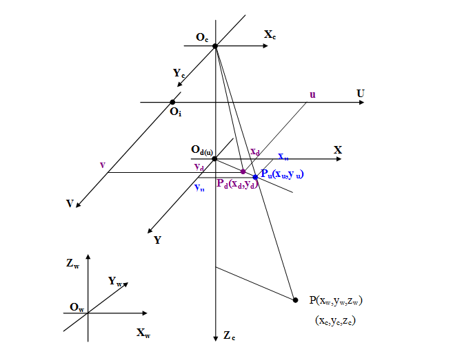
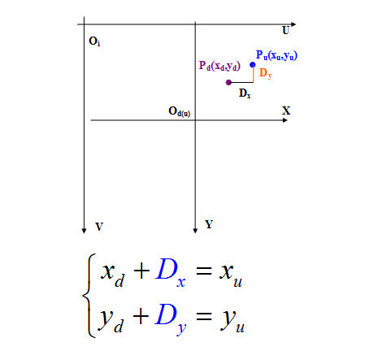
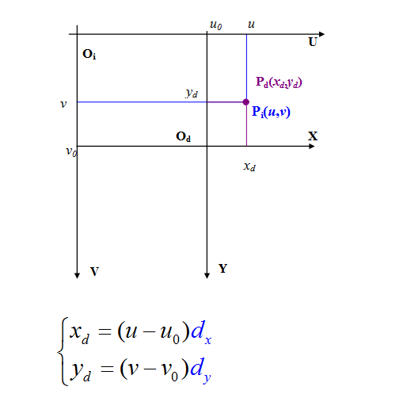
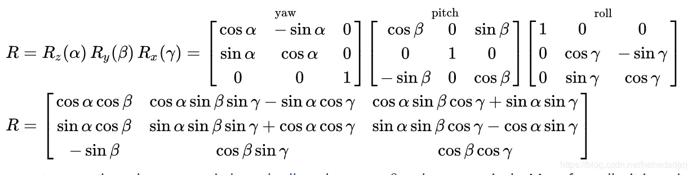
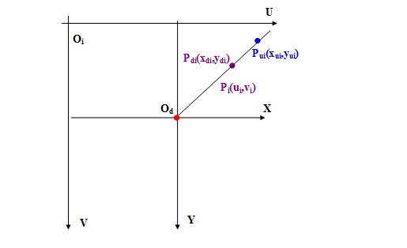

# 一、相机数学模型
    相机模型为以后一切标定算法的关键，只有这边有相当透彻的理解，对以后的标定算法才能有更好的理解。本人研究了好长时间，几乎每天都重复看几遍，最终才会明白其推导过程。

    我觉得首先我们要理解相机模型中的四个平面坐标系的关系：像素平面坐标系（u,v）、像平面坐标系（图像物理坐标系（x,y）、相机坐标系（Xc,Yc,Zc）和世界坐标系（Xw,Yw,Zw），在每一篇介绍相机模型的文章中都有介绍。
    我刚开始理解时，看着那一堆的公式十分的头晕，我相信很多初学者和我一样，但仔细想想，只不过是，我们假设了一些参数，使四个坐标系之间的坐标联系起来，这样我们就可以从拍摄的图片上一个点坐标一路反推出世界中的那个点的坐标，这样就达到了我们的目的，三维重建。而那些我们假设的参数，就是我们要标定的内外参数。

## 1、像素坐标与像平面坐标系之间的关系 
    确定他们的关系之前，我们可以假设每一个像素在u轴和v轴方向上的物理尺寸为dx和dy。仔细看下模型可推出以下公式（这还是比较好理解的）：
$$
u = x/dx + u_0 \\
v = y/dy + v_0
$$                                                     
      解释：1、$dx,dy,u_0,v_0$ 是我们假设出来的参数，也是我们最终要求的内外参数。

得出这个公式后，我们可用线性代数的知识，把方程用矩阵形式表示：
$$
\begin{bmatrix} u \\ v \\ 1 \\ \end{bmatrix} = 
\begin{bmatrix}
1/dx & 0 & u_0 \\
0 & 1/dy & v_0 \\
0 & 0 & 1 
\end{bmatrix} 
\begin{bmatrix} x \\ y \\ 1 \\ \end{bmatrix} 
$$

当然我们也可以用另一种矩阵方式表示：
$$
\begin{bmatrix} x \\  y \\ 1 \\  \end{bmatrix} = 
\begin{bmatrix}
dx & 0 & -u_0 dx \\
0 & dy & -v_0 dy \\
0 & 0 & 1 
\end{bmatrix}
\begin{bmatrix} u \\ v \\ 1 \end{bmatrix} 
$$

## 2、相机坐标系与世界坐标系之间的关系 
   这两个坐标系之间的关系，我们可用旋转矩阵R和平移矩阵T，来得到以下关系：
$$
\begin{bmatrix} X_c \\  Y_c \\ Z_c \\ 1 \\  \end{bmatrix} = 
\begin{bmatrix} R & T \\  0^T & 1 \\  \end{bmatrix}
\begin{bmatrix} X \\  Y \\ Z \\ 1 \\  \end{bmatrix} = 
L_w
\begin{bmatrix} X \\  Y \\ Z \\ 1 \\  \end{bmatrix} 
$$
   解释：1、 在这个公式中，R为3*3矩阵，T为3*1，0为（0，0，0），用 $L_w$ 表示简化后的4*4矩阵。
              

## 3、成像投影关系（相机坐标系与像平面坐标系） 
在相机模型中我们可以得到以下公式：
$$
\begin{cases} 
		x / f = X_c / Z_c \\
		y / f = Y_c / Z_c \\					
\end{cases} =>
\begin{cases} 
		Z_c * x = f * X_c  \\
		Z_c * y = f * Y_c  \\					
\end{cases}
$$
同样我们用矩阵形式表示：
$$
Z_c \begin{bmatrix} x \\  y  \\ 1 \\  \end{bmatrix} =
\begin{bmatrix} f & 0 & 0 & 0 \\  0 & f & 0 & 0 \\ 0 & 0 & 1 & 0 \\  \end{bmatrix} 
\begin{bmatrix} X_c \\  Y_c \\ Z_c \\ 1 \\  \end{bmatrix}  
$$     
                                     
## 4、得到公式

而我们可以将以上公式综合一下就可以得到：
$$
Z_c \begin{bmatrix} u \\  v  \\ 1 \\  \end{bmatrix} =
\begin{bmatrix}
1/dx & 0 & u_0 \\
0 & 1/dy & v_0 \\
0 & 0 & 1 
\end{bmatrix} 
\begin{bmatrix} f & 0 & 0 & 0 \\  0 & f & 0 & 0 \\ 0 & 0 & 1 & 0 \\  \end{bmatrix} 
\begin{bmatrix} R & T \\  0^T & 1 \\  \end{bmatrix}
\begin{bmatrix} X \\  Y \\ Z \\ 1 \\  \end{bmatrix} = 
L \begin{bmatrix} X \\  Y \\ Z \\ 1 \\  \end{bmatrix} =
\begin{bmatrix} 
l_1 & l_2 & l_3 & l_4 \\
l_5 & l_6 & l_7 & l_8 \\
l_9 & l_{10} & l_{11} & l_{12} \\
\end{bmatrix} 
\begin{bmatrix} X \\  Y \\ Z \\ 1 \\  \end{bmatrix}
$$  
 乘开用方程表示： $$                                                                             
u = (l_1 X + l_2 Y + l_3 Z + l_4) / Z_c \\
v = (l_5 X + l_6 Y + l_7 Z + l_8) / Z_c \\
Z_c = l_9 X + l_{10} Y + l_{11} Z + l_{12} \\
$$                                
  把Zc代替可得到以下公式：                                                    
$$
\begin{cases} 
		u = \frac{l_1 X + l_2 Y + l_3 Z + l_4}{l_9 X + l_{10} Y + l_{11} Z + l_{12}}  \\
		v = \frac{l_4 X + l_5 Y + l_6 Z + l_7}{l_9 X + l_{10} Y + l_{11} Z + l_{12}}  \\					
\end{cases}                               
$$                                                 
   解释：1、式中:
- $l_1,l_2,…,l_{11}$ 是11个与 $u_0,v_0,f,K_x,K_y,U,X,J $ 及 $XS,YS,ZS$ 有关的系数;确定了像机的成像特性。
- $x_0,y_0,f$称为摄像机内方位元, $U,X,J与XS,YS,ZS$ 称为摄像机外方位元。
- 若已知6个以上空间点$(X_i,Y_i,Z_i)$及其像坐标$(u_i,v_i)$，就可由式上式解出$L_1,L_2,…,L_{11}$;从而得到像机参数。
- 若已知两部以上像机的参数$L_1,L_2,…,L_{11}$;根据空间点在各摄像机的像坐标$(x_j,y_j)$，由上式就可解算出空间坐标(X,Y,Z)。
- 确定$L_1,L_2,…,L_{11}$的过程称为标定，由(xj,yj)解算(X,Y,Z)的过程称为重构。

由于公式是复制得，以下用P代替：
$$
p_{11} X_w + p_{12} Y_w + p_{13} Z_w + p_{14} - p_{31} u X_w - p_{32} u Y_w - p_{33} u Z_w - p_{34} u  = 0 \\  
p_{21} X_w + p_{22} Y_w + p_{23} Z_w + p_{24} - p_{31} v X_w - p_{32} v Y_w - p_{33} v Z_w - p_{34} v  = 0 \\  
$$                      
移项可得：
$$
p_{11} X_w + p_{12} Y_w + p_{13} Z_w + p_{14} - p_{31} u X_w - p_{32} u Y_w - p_{33} u Z_w = p_{34} u  \\  
p_{21} X_w + p_{22} Y_w + p_{23} Z_w + p_{24} - p_{31} v X_w - p_{32} v Y_w - p_{33} v Z_w = p_{34} v  \\  
$$                    
解释：
1. 由上可见，由空间6个以上的已知点与它们的图像点坐标就可得到P矩阵。在一般的标定工作中，靶标上会有数十个已知特征点，使方程的个数大大超过未知数的个数，从而降低由最小二乘法求解造成的误差影响。
2. 当标定点有N个时，就意味着上述方程有2N个，此时我们可以用矩阵把这2N个方程表示出来，该公式为：   
$$
    A L = U
$$                                                        
其中L为：
$$
 \begin{bmatrix} p_{11} & p_{12}  & p_{13} & p_{14} & p_{21} & p_{22} & p_{23} & p_{24} & p_{32} & p_{33} & p_{34} \end{bmatrix} ^T                                
$$
A为：
$$
\begin{bmatrix}      
 X_{w1} & Y_{w1} & Z_{w1} & 1 & 0 & 0 & 0 & 0 & - u_1 X_{w1} & - u_1 Y_{w1} & - u_1 Z_{w1} \\ 
 0 & 0 & 0 & 0 & X_{w1} & Y_{w1} & Z_{w1} & 1 & - v_1 X_{w1} & - v_1 Y_{w1} & - v_1 Z_{w1} \\
 &...&...&...&...&...&...&...&...&...&...\\
  X_{wn} & Y_{wn} & Z_{wn} & 1 & 0 & 0 & 0 & 0 & - u_n X_{wn} & - u_1 Y_{wn} & - u_n Z_{wn} \\ 
 0 & 0 & 0 & 0 & X_{wn} & Y_{wn} & Z_{wn} & 1 & - v_n X_{wn} & - v_n Y_{wn} & - v_n Z_{wn} \\
\end{bmatrix}
$$
U为：
$$
\begin{bmatrix}                           
u_1 p_{34} & v_1 p_{34} & ... & u_n p_{34} & v_n p_{34}
\end{bmatrix} ^ T
$$
   这个公式大家可以写出来，这样就比较好看了，列出来以后可以看出P34对其他值是没有影响的，因此令P34=1。
上面说了，在2N个点时，我们可以通过最小二乘法使结果更加精确，其结果为：
$$
 L' = (A^T A)^{-1} A^T U
$$                           
   公式 解释：
1. 因为在实际坐标与图像坐标为已知，所以A和U是已知的，所以可求出L。
2. P34为1，所求出的L为P11到P33.

   这样所有的P我们都求出来了，这就又回到了上式中，我们用P参数把内外参数的公式代替方便求解，我们可以通过P参数来反推出内外参数，由于这部分比较好理解，就不写了，粘贴公式太麻烦了。
 

# Tsai两步标定法
在直接线性标定方法中，没有考虑相机镜头的非线性畸变，而在Tsai提出的两步标定法中很好的解决了这个问题。相关理论推导如下：

## 1、相机畸变模型

在前一篇文章中有提到，应该比较好理解。

我们可以看出在上图中可以分以下几个坐标系：
 -　像机坐标系Oc
 -　图像像素坐标系Oi
 -　世界坐标系Ow
 -　实际图像物理坐标系Od
 -　理想图像物理坐标系Ou

## 2、畸变量
此时，畸变量可分为在X方向和Y方向上，这里我们只考虑了径向畸变，忽略其他畸变，径向畸变本身是有一定的线性关系的，下面畸变模型的讲解时也会说到：

Ｄx：x方向畸变量
Ｄy：y方向畸变量

# 3、实际图物理坐标系与像素坐标系的关系（基本关系）

dx: x方向的像素距（每个像素在x方向的长度）
dy: y方向的像素距（每个像素在y方向的长度）

## 4、基本公式（在线性标定的基础上）
$$
\begin{cases} 
(u - u_0) + D_x / d_u = \frac{f_u(r_{11} X_w + r_{12} Y_w + r_{13} Z_w + t_x) }{r_{31} X_w + r_{32} Y_w + r_{33} Z_w + t_z} \\
(v - v_0) + D_y / d_v = \frac{f_v(r_{11} X_w + r_{12} Y_w + r_{13} Z_w + t_y) }{r_{31} X_w + r_{32} Y_w + r_{33} Z_w + t_z} \\
\end{cases} 
$$

$$
\begin{cases} 
(u - u_0) d_u + D_x  = x_d + D_x = f X_c / Z_c = \frac{f(r_{11} X_w + r_{12} Y_w + r_{13} Z_w + t_x) }{ r_{31} X_w + r_{32} Y_w + r_{33} Z_w + t_z} \\
(v - v_0) d_v + D_y  = y_d + D_y = f Y_c / Z_c = \frac{f(r_{11} X_w + r_{12} Y_w + r_{13} Z_w + t_y) }{ r_{31} X_w + r_{32} Y_w + r_{33} Z_w + t_z} \\
\end{cases} 
$$

其中
- f 相机焦距
- $d_u, d_v 就是之前的 d_x, d_y$
- T 是平移向量 = $ \begin{bmatrix} t_x & t_y & t_z \end{bmatrix} $ 
- R 是旋转矩阵 = $
 \begin{bmatrix}  
 r_{11} & r_{12} & r_{13} \\
 r_{21} & r_{22} & r_{33} \\
 r_{31} & r_{32} & r_{33} \\
\end{bmatrix}  
$
### 旋转矩阵
假如两个坐标轴之间的变换关系为，坐标系1 先绕 Oz 轴旋转， 再绕 Oy 轴旋转， 最后绕 Ox 轴旋转，最终得到了坐标系2，则 旋转矩阵R 为这三个 基元旋转矩阵 依次 左乘 。
即三维空间中，完整的旋转矩阵如下表述：

在矩阵论中，正交矩阵满足以下条件：
- 它的转置矩阵是它的逆矩阵，即 $A^T = A ^ {-1}$
- 它的转置矩阵和它本身乘为E，即 $A^T A = E = A A^T$
- 正交矩阵的行列式是正负1.
- 正交矩阵的每一列都是单位向量，互相正交，即模为1。
但是如果正交矩阵的行列式为 1，则我们称之为特殊正交矩阵--旋转矩阵，而正交矩阵行列式为-1时，为镜面反射。因此正交矩阵的性质，旋转矩阵统统继承。

后面需要用到两个性质，旋转矩阵是一个完美的矩阵——正交矩阵：
知道了初始的旋转矩阵Rx, Ry, Rz是旋转矩阵还不行，我必须得清楚，旋转矩阵相乘，是否仍然是旋转矩阵，摘了wiki百科的一段话:
> 所有特殊正交矩阵形成一个子群，称为特殊正交群。即，旋转矩阵与旋转矩阵的乘积也是一个旋转矩阵

这保证了三个旋转矩阵相乘之后，仍然是旋转矩阵，旋转矩阵的那些性质仍然能用上，即正交矩阵的性质也能用上。我们需要下面两个性质：
- R所有列向量单位向量，且互相正交。
- R的逆等于它的转置。

## 5、畸变的总体表示

$$
\begin{cases} 
D_x = D_{rx} + D_{tx} + D_{px} \\
D_x = D_{ry} + D_{ty} + D_{py} \\
\end{cases} 
$$

- Dr 径向畸变
- Dt 离心畸变
- Dp 薄棱镜畸变
 
### 径向畸变及其规律（径向约束）：

$$
\begin{cases} 
D_{rx} = x_d (k_1 r^2 + k_2 r^4 + k_3 r^6 + ...) \\
D_{ry} = y_d (k_1 r^2 + k_2 r^4 + k_3 r^6 + ...) \\
r ^ 2 = x_d ^ 2 + y_d ^ 2
\end{cases} 
$$

### 离心畸变：
$$
\begin{cases} 
D_{tx} = p_1 ( 3 x_d^2 + y_d^2) + 2 p_2 x_d y_d + ... \\
D_{ty} = 2 p_1 x_d y_d + p_2 (x_d ^2 +  3 y_d^2) + ... \\
\end{cases} 
$$

### 薄棱镜畸变：
$$
\begin{cases} 
D_{px} = s_1 (x_d^2 + y_d^2) \\
D_{py} = s_2 (x_d^2 + y_d^2) \\
\end{cases} 
$$

### 总畸变：
$$
\begin{cases} 
D_x = k_1 x_d r^2 + p_1 ( 3 x_d^2 + y_d^2) + 2 p_2 x_d y_d + s_1 r^2 \\
D_x = k_1 y_d r^2 + 2 p_1 x_d y_d + p_2 (x_d ^2 +  3 y_d^2) + s_2 r^2 \\
\end{cases} 
$$

畸变系数：
- 径向畸变：k1
- 离心畸变：p1, p2
- 薄棱径畸变：s1, s2

## 7、模型参数

- 内参数：
  -  焦比：fu, fv
  -  图像中心（主点）坐标：u0,v0
  - 畸变系数： k1, p1, p2, s1, s2

- 外参数：
  -  平移矢量：Ｔ
  -  旋转矩阵：Ｒ

### 典型标定方法
- 利用像机畸变模型建立约束方程
- 确定优化目标函数

以非线性优化方法求解

缺点：
 - 优化程序计算复杂，速度慢
 - 标定的结果取决于初始值

## 8、两步标定法正式开始

1987年由Tsai提出

第一步：求除tz外的所有外参数
 - 利用径向排列约束（RAC）
 - 线性求解

第二步：求其余参数
 - 非线性优化

两步法的前提，假设：
 - u0,v0已知
 - 只考虑二阶径向畸变
 - 主点既是图像中心又是径向畸变中心

## 10、公式推导
$$
\begin{align*}
x_{ui} & = x_{di} + D_{xi} \\
       & = x_{di} + k_1 x_{di} r^2 \\
       & = x_{di} (1 + k_1 r^2) \\
       & = d_u(u_i - u_0) (1 + k_1 r^2) \\
       & = \frac{f(r_{11} X_w + r_{12} Y_w + r_{13} Z_w + t_x) }{ r_{31} X_w + r_{32} Y_w + r_{33} Z_w + t_z}
\end{align*}
$$

得到以下公式：
$$
\begin{align*}
x_{ui} & = d_u(u_i - u_0) (1 + k_1 r^2) \\
       & = \frac{f(r_{11} X_w + r_{12} Y_w + r_{13} Z_w + t_x) }{ r_{31} X_w + r_{32} Y_w + r_{33} Z_w + t_z} \\
y_{ui} & = d_v(v_i - v_0) (1 + k_1 r^2) \\
       & = \frac{f(r_{21} X_w + r_{22} Y_w + r_{23} Z_w + t_y) }{ r_{31} X_w + r_{32} Y_w + r_{33} Z_w + t_z} \\
\end{align*}
$$
## 11、径向约束公式

$$
\frac{x_{ui}}{y_{ui}} = \frac{d_u(u_i - u_0)}{ d_v(v_i - v_0)} = \frac{x_{di}}{y_{di}} = \frac{f/f_u(u_i-u_0)}{f/f_v(v_i - v_0)} = \frac{(f_u/f_v)^{-1}(u_i - u_0)}{(v_i - v_0)} = \frac{s_x^{-1}(u_i - u_0)}{(v_i - v_0)}\\
$$
上面已经求出：
$$
\frac{x_{ui}}{y_{ui}} = \frac{r_{11}x_{wi} + r_{12}y_{wi} + r_{13}z_{wi} + t_x}{r_{21}x_{wi} + r_{22}y_{wi} + r_{23}z_{wi} + t_y}
$$

综合可得：
$$
\frac{r_{11}x_{wi} + r_{12}y_{wi} + r_{13}z_{wi} + t_x}{r_{21}x_{wi} + r_{22}y_{wi} + r_{23}z_{wi} + t_y} = \frac{(s_x)^{-1}(u_i - u_0)}{v_i - v_0}
$$
乘开：
$$
(r_{11} /t_y x_{wi} + r_{12} /t_y y_{wi} + r_{13} /t_y z_{wi} + t_x/t_y) s_x (v_i - v_0) \\
= (r_{21} /t_y x_{wi} + r_{22} /t_y y_{wi} + r_{23} /t_y z_{wi} + 1) (u_i - v_0)
$$

## 12、第一步
1. 求中间变量
为了方便表示与计算，用参数将变量代替：
$$
(a_1 x_{wi} + a_2 y_{wi} + a_3 z_{wi} + a_4)(v_i - v_0) = (a_5 x_{wi} + a_6 y_{wi} + a_7 z_{wi} + 1)(u_i - u_0)
$$
2. 求|ty|
$$
a_5 = r_{21}/t_y \\
a_6 = r_{22}/t_y \\
a_7 = r_{23}/t_y \\ 
由于旋转矩阵，正交性有: r_{21}^2 + r_{22}^2 + r_{23}^2 = 1\\
t_y^2 = \frac{1}{a_5^2 + a_6^2 + a_7^2} \\
r_{11} = a_1 t_y / s_x \\
r_{12} = a_2 t_y / s_x \\
r_{13} = a_3 t_y / s_x \\
$$

3. 求$s_x$
$$
a_1 = s_x r_{11} / t_y \\
a_2 = s_x r_{12} / t_y \\
a_3 = s_x r_{13} / t_y \\
s_x = t_y \sqrt{a_1^2 + a_2^2 + a_3^2} = \sqrt{ \frac{a_1^2 + a_2^2 + a_3^2}{a_5^2 + a_6^2 + a_7^2}} \\
$$
4. 求tx
$$
t_x = a_4 t_y / s_x \\ 
a_4 = s_x t_x / t_y
$$

5. 求R：
$$
r_{31} = r_{12} r_{23} - r_{13} r_{22} r_{21} = a_5 t_y \\
r_{32} = r_{13} r_{21} - r_{11} r_{23} r_{22} = a_6 t_y \\
r_{33} = r_{11} r_{22} - r_{12} r_{21} r_{23} = a_7 t_y \\
$$
6. 确定ty符号:
$$
\begin{cases} 
x_{ci} = r_{11} x_{wi} + r_{12} y_{wi} + r_{13} z_{wi} + t_x \\
y_{ci} = r_{21} x_{wi} + r_{22} y_{wi} + r_{23} z_{wi} + t_y \\
\end{cases} 
$$

设ty>0, 求其它参数

用远离图像中心的特征点计算:

假设条件正确:
- $x_{ci} 与 u_i-u_0同号$
- $y_{ci} 与 v_i-v_0同号$

剩余参数:fu,fv, tz, k1
约束方程：

13、第二步
剩余参数:fu,fv, tz, k1
$$
\begin{cases}
(u_i - u_0)(1+k_1 r_i^2) = \frac{f_u(r_{11} x_{wi} + r_{12} y_{wi} + r_{13} z_{wi} + t_x)}{r_{31} x_{wi} + r_{32} y_{wi} + r_{33} z_{wi} + t_z} = \frac{f_u x_{ci}}{w_i + t_z}\\ 
(v_i - v_0)(1+k_1 r_i^2) = \frac{f_u(r_{21} x_{wi} + r_{22} y_{wi} + r_{23} z_{wi} + t_y)}{r_{31} x_{wi} + r_{32} y_{wi} + r_{33} z_{wi} + t_z} = \frac{f_v y_{ci}}{w_i + t_z}\\ 
\end{cases} \\
r_i^2 = x_{di}^2 + y_{di}^2 = [(u - u_0)d_u]^2 + [(v-v_0)d_v]^2 \\
s_x = f_u / f_v = \frac{f/d_u}{f/d_v} = d_v / d_u \\
f_u = s_x f_v \\
d_v = s_x d_u \\
u_i, v_i, u_0, v_0, x_{ci}, y_{ci}, w_i, s_x \\
1 + k_1 r_i^2 = 1 + k_1 d_u^2[(u - u_0)^2 + s_x^2 (v - v_0)^2] \\
\begin{cases}
(u_i - u_0)\{ 1+ k_1 d_u^2 [(u-u_0)^2 + s_x^2(v - v_0)^2]\} = \frac{s_x f_v x_{ci}}{w_i + t_z} \\
(v_i - v_0)\{ 1+ k_1 d_u^2 [(u-u_0)^2 + s_x^2(v - v_0)^2]\} = \frac{f_v y_{ci}}{w_i + t_z}
\end{cases}
$$

已知：
$$
f_v, d_u, k_1, t_z
$$
求：

方法：非线性优化

确定初始值：

  k1=0, dv=1

  忽略非线性畸变，求解fv和tz
$$
\begin{cases}
(u_i - u_0) (w_i + t_z) = s_x f_v x_{ci} \\
(v_i - v_0) (w_i + t_z)= f_v y_{ci} \\
\end{cases} \\
\begin{bmatrix}
s_x x_{ci} - (u_i - u_0) \\
y_{ci} - (v_i - v_0)
\end{bmatrix} 
\begin{bmatrix}
t_z \\ f_v \\
\end{bmatrix} = 
\begin{bmatrix}
w_i (u_i - u_0) \\ w_i (v_i - v_0) \\
\end{bmatrix}
$$

## 14、U0，V0的标定
### 直接光学法
用一束激光照射像机镜头
在光路上放一张有孔的纸
使激光的入射光线与反射光线重合
用像机摄取包含激光光斑的图象
光斑的中心坐标即为光心坐标
调整困难但精度较高 

### 变焦距法
条件：光心与镜头的缩放中心重合
实现：
  不同距离分别对多个特征点成像
  每个特征点一个线性方程
$$
\frac{u_i^’ - u_0}{u_i - u_0} = \frac{v_i^’ - v_0}{v_i - v_0} \\
u_0 (v_i - v_i^’) + v_0 (u_i^’ - u_i) = u_i^1 v_i - u_i v_i^’ \\
$$
### 径向排列约束法
$$
\frac{(u_i - u_0) d_u}{(v_i - v_0)d_v} = \frac{r_{11} x_{wi} + r_{12} y_{wi} + r_{13} z_{wi} + t_x}{r_{21} x_{wi} + r_{22} y_{wi} + r_{23} z_{wi} + t_y} \\
\frac{u_i - u_0}{v_i - v_0} = \frac{a_1 x_{wi} + a_2 y_{wi} + a_3}{a_4 x_{wi} + a_5 y_{wi} + 1}
$$
利用共面标定板，取 $z_{wi}=0$
非线性优化求解

## 15、小小总结一下：
前面标定方法共性：

  已知特征点二维图像坐标与三维空间坐标
  需要标定参照物

统称：传统标定方法

优点：适用任意摄像机模型，标定精度高
不足：需标定参照物，某些应用中难以实现